# Benchmarks 2022
## Day 1
### Part 1
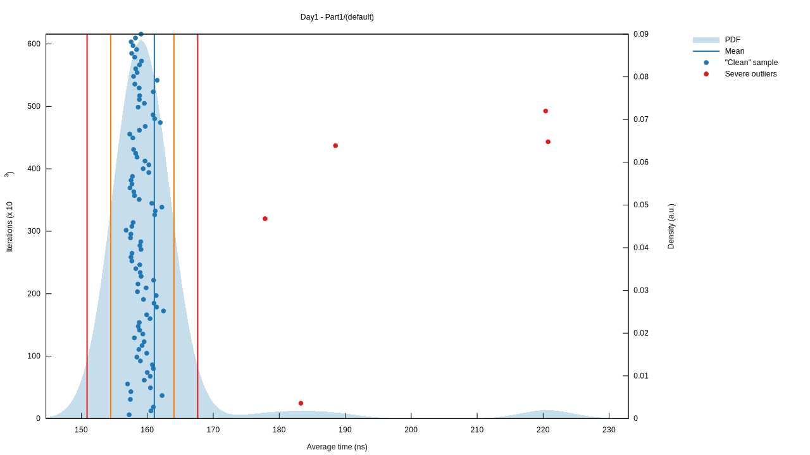
### Part 2
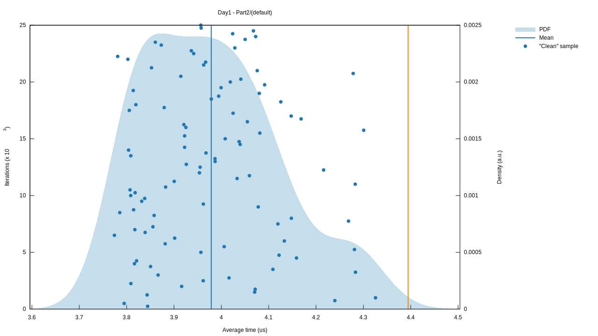
## Day 2
### Part 1
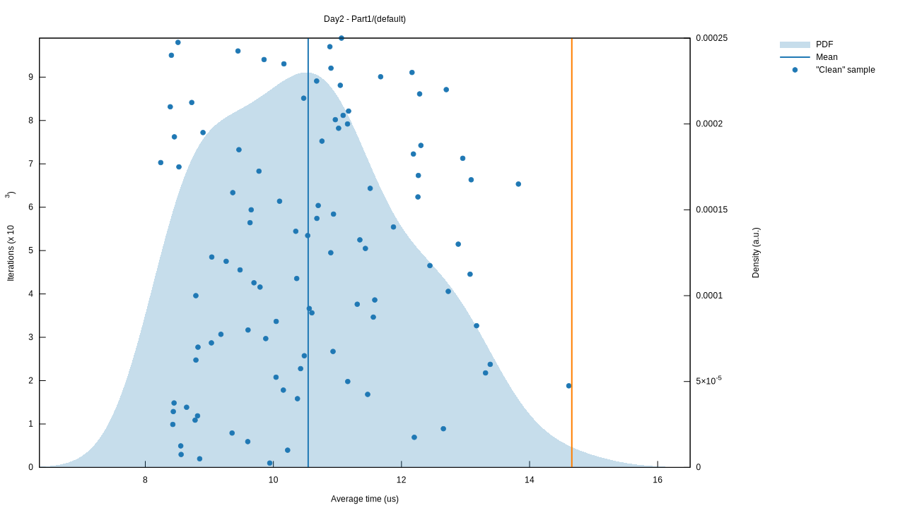
### Part 2
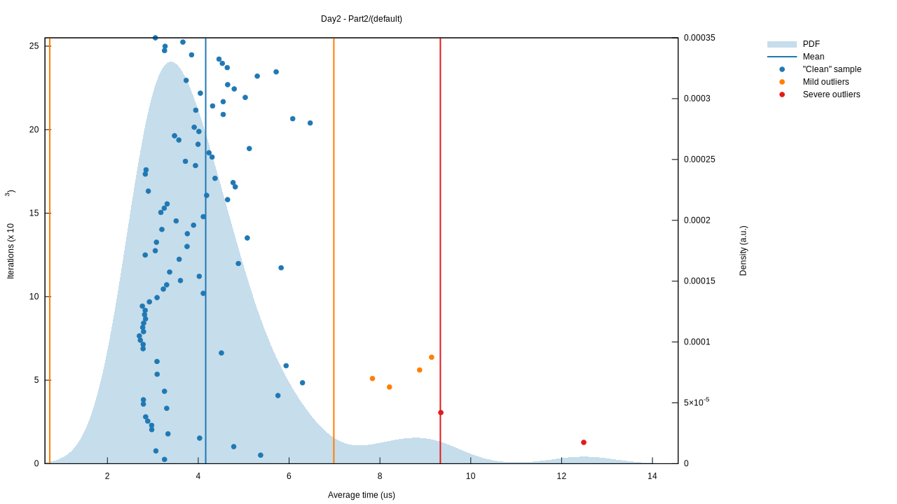
## Day 3
### Part 1
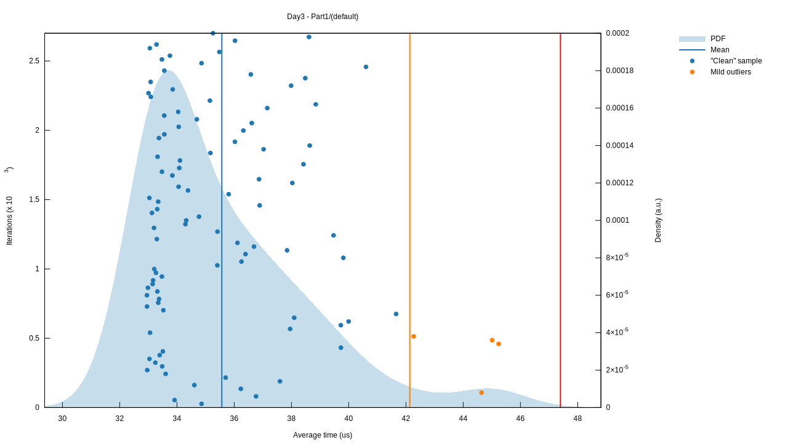
### Part 2
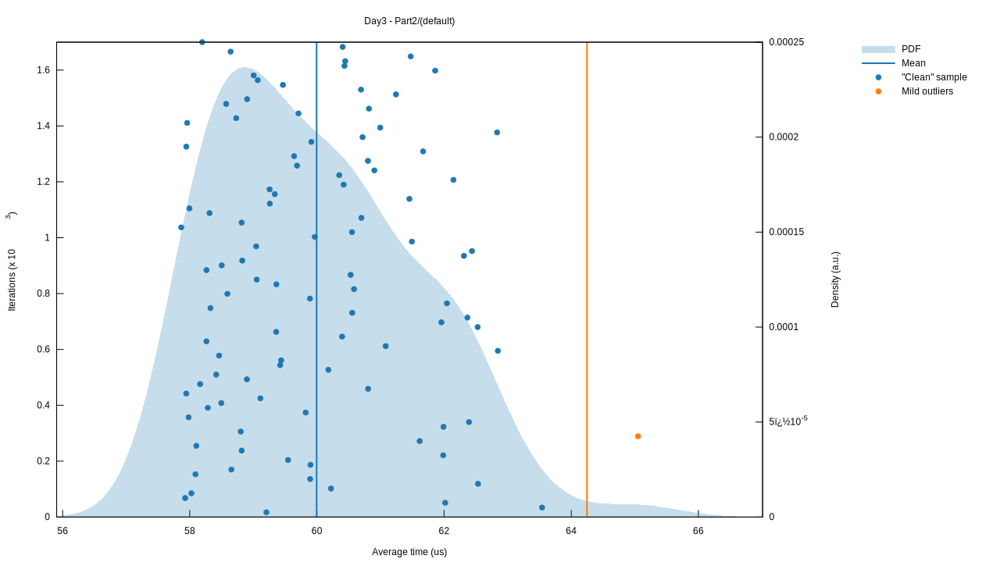
## Day 4
### Part 1
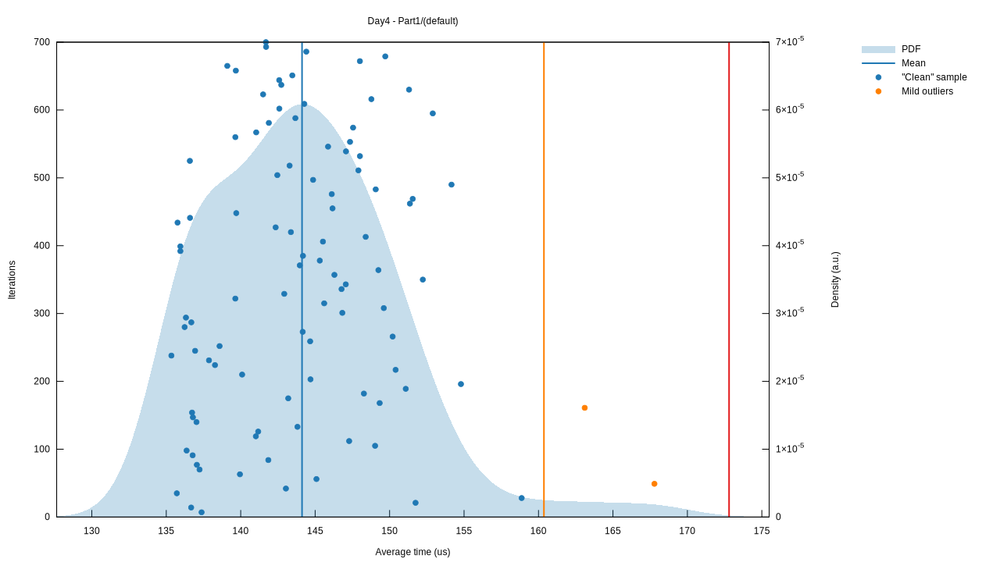
### Part 2
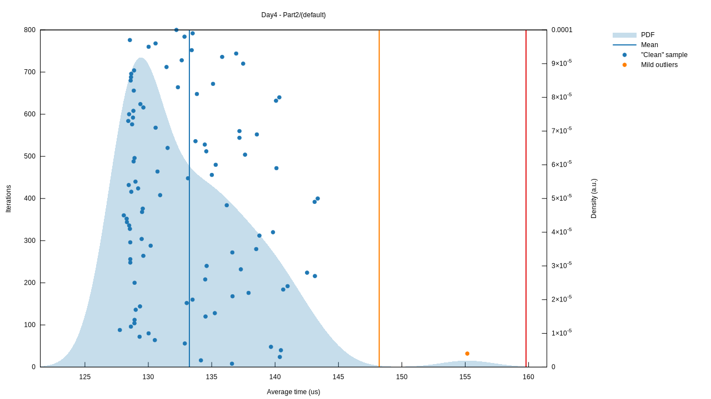
## Day 5
### Part 1
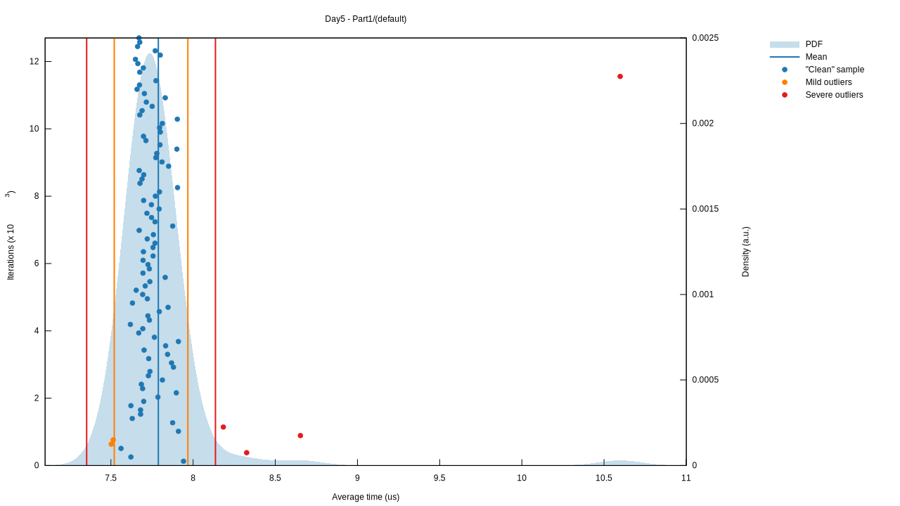
### Part 2
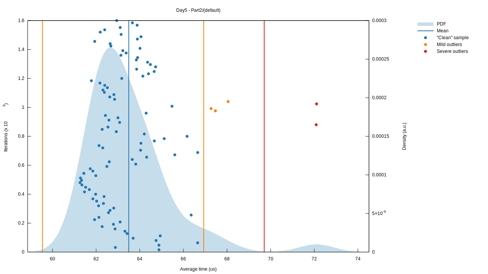
## Day 6
### Part 1
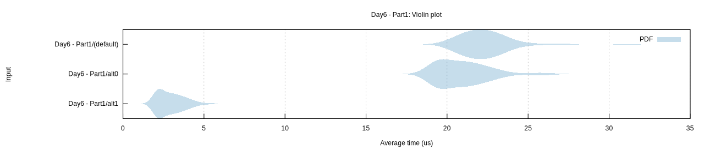
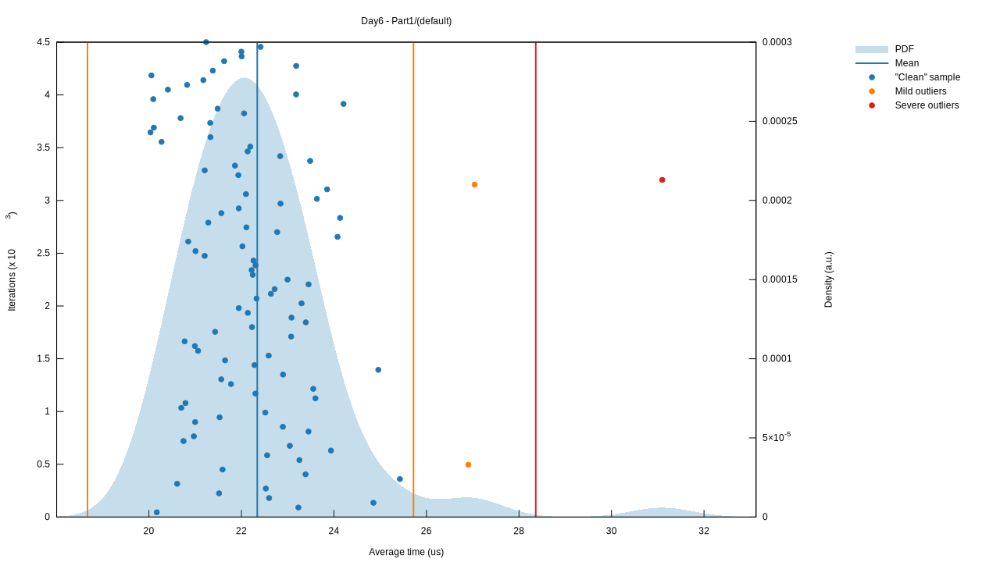
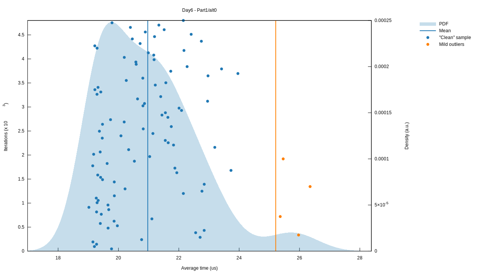
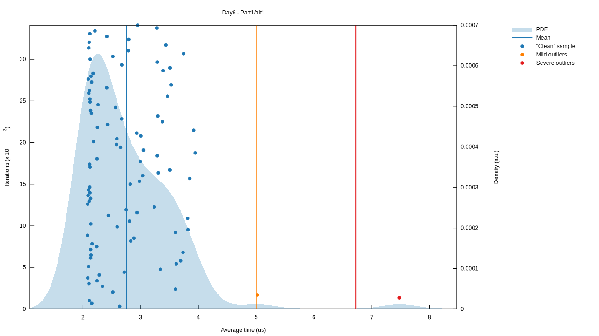
### Part 2
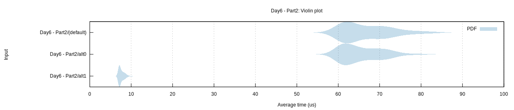
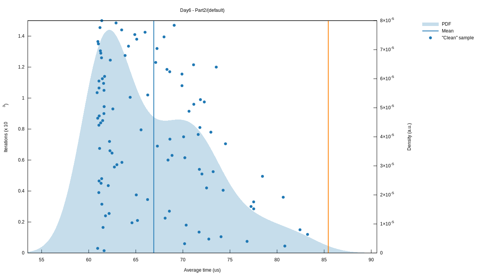
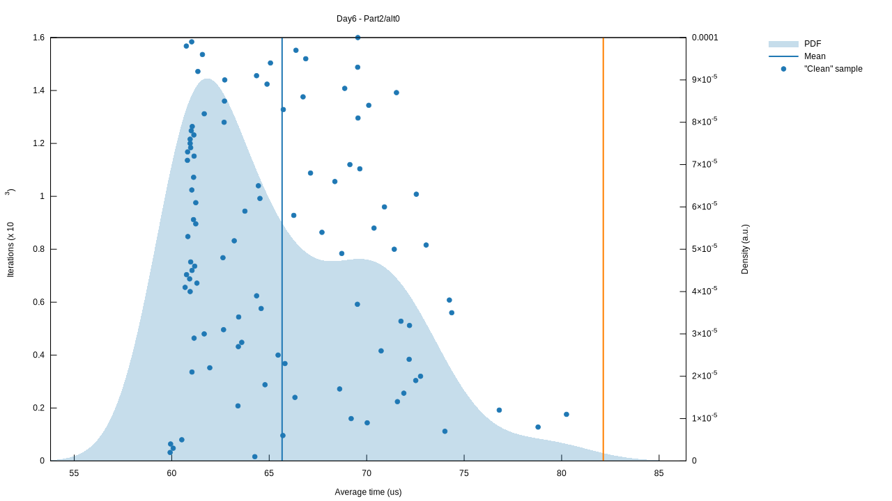
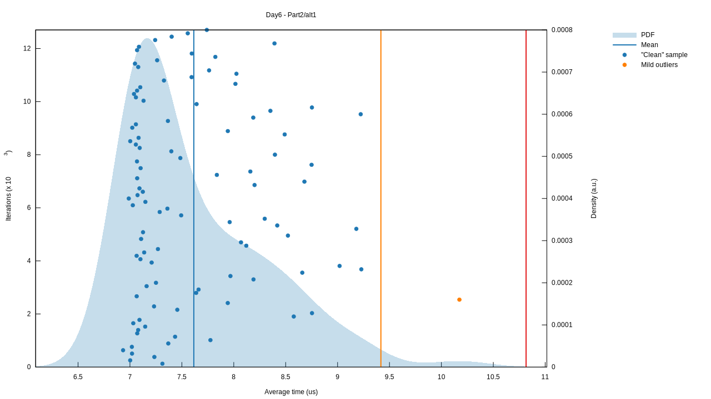